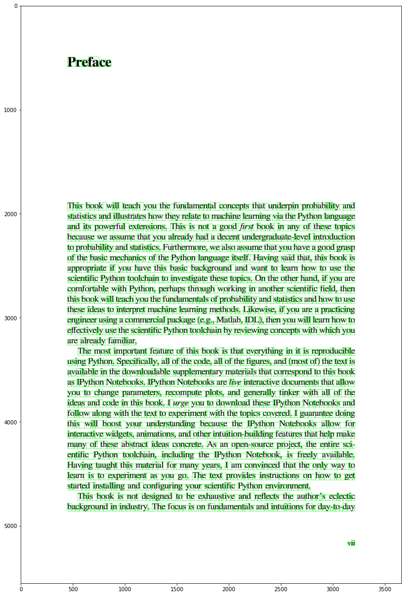

```python
from segm import get_glyphs
import cv2
import matplotlib.pyplot as plt
```


```python
def segment_image(image_path):
    img = cv2.imread(image_path)
    g = cv2.cvtColor(img, cv2.COLOR_BGR2GRAY)
    _, new_g  = cv2.threshold(g, 0, 255, cv2.THRESH_BINARY_INV | cv2.THRESH_OTSU)
    s = get_glyphs(new_g)
    return s, img


def draw_glyphs(s, img):
    img = img.copy()
    for gl in s:
        cv2.rectangle(img,(gl.x,gl.y),(gl.x + gl.width,gl.y + gl.height),(0,255,0),2)
    return img


segments, img = segment_image('preface.png')
img = draw_glyphs(segments, img)
```


```python
plt.rcParams['figure.figsize'] = [20, 20]
plt.imshow(img)
```


    <matplotlib.image.AxesImage at 0x13bd94fd0>


    

    


```python

```
