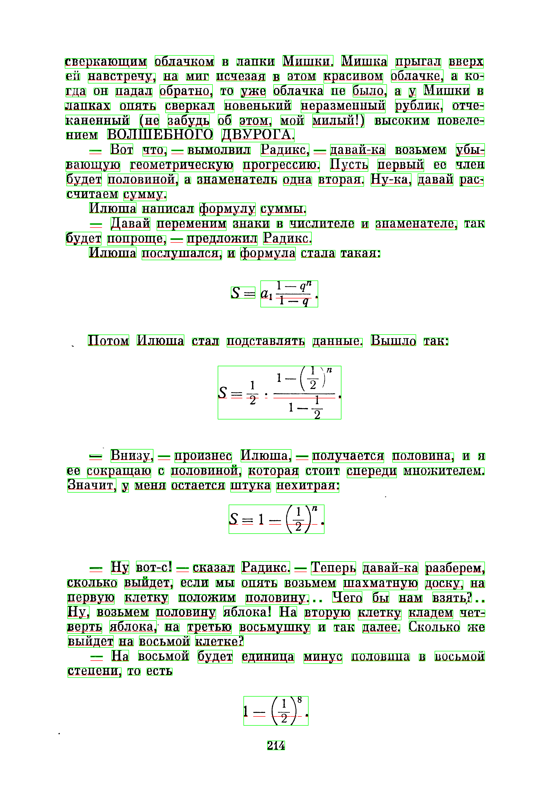

# Improved page segementation
## segm module is implemented in C++

### Segmentation Algorithm
* Open an image file as numpy array in grayscale
* Find all components containing connected pixels
* For every connected component of pixels find bounding rectangle
* Eliminate all rectangles contained inside other rectangles
* Join all intersecting rectangles
* Make a histogram of rectangle heights
* The hight with the highest frequency is text height
* Mark all components with the hight or width > than 5 * by text hight as images
* For every rectangle find a neighboring rectangle to the left, it is a nearest rectangle to the left intersecting the interval from component y coordinate to y + height
* Create a graph, connect all components with their right neighbors
* Find connected components in that graph
* Join intersecting components
* Those components are text lines
* Sort lines and symbols inside them

### Python extension build instructions

* install cmake, opencv, boost, flann, leptonica, lz4 (linux with apt, macos with brew)
* pip install skbuild, opencv-python, pyflann
* run python setup.py build
* if no errors, python setup.py install

```python
from segm import join_rects
import matplotlib.pyplot as plt
import cv2

def segment_image(filename):
    img = cv2.imread(filename, 0)
    orig = cv2.imread(filename)
    jr = join_rects(img)
    for i, r in enumerate(jr):
        cv2.rectangle(orig,(r.x,r.y),(r.x + r.width,r.y + r.height),(0,255,0),2)

    return orig
    
filename = 'libsegm/vd_p122.png'

img = segment_image(filename)

plt.rcParams['figure.figsize'] = [20, 20]
plt.imshow(img)
```
    <matplotlib.image.AxesImage at 0x7feb138f58b0>
    


```python
    
    import cv2
    from segmentation import find_ordered_glyphs
    
    filename = 'vd_p214.png'
    orig = cv2.imread(filename)
    glyphs = find_ordered_glyphs(filename)
    counter = 1
    font = cv2.FONT_HERSHEY_SIMPLEX
    for gl in glyphs:
        cv2.rectangle(orig, (gl.x, gl.y), (gl.x + gl.width, gl.y + gl.height), (255,0,0), 2)
        cv2.putText(orig, str(counter), (gl.x, gl.y), font, 1, (255,0,0), 2, cv2.LINE_AA)
        counter += 1


```

